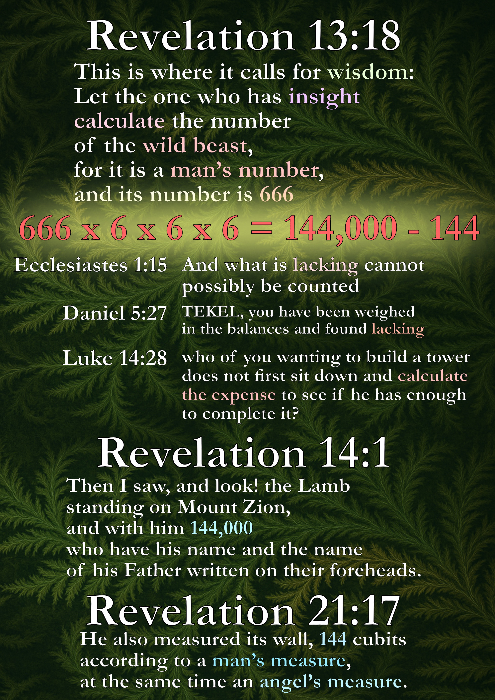

# Calculating the Number of the Beast

**Revelation 13:18** commands: *“Let the one who has understanding calculate the number of the beast, for it is the number of a man, and his number is 666.”*

The calculation can be expressed in one compact identity:

> **(144,000 - 144) / 6 / 6 / 6 = 666**
>
> 666 x 6 x 6 x 6 = 144,000 - 144

This formula is not an arbitrary trick. It arises directly from the structure of Revelation.

**144,000 – 144**: the subtraction of 144, which is both a man’s measure and an angel’s measure (Revelation 21:17). Ecclesiastes 1:15 says: *“What is lacking cannot be counted.”* Thus, 143,856 becomes a lacking base for further calculation. Daniel 5:27 states: *“TEKEL, you have been weighed in the balance and found lacking,”* which conveys a similar idea. In Luke 14:28 the same Greek verb *psephisatō* (“calculate”) is used as in Revelation 13:18. Since Revelation begins with the words: *“A revelation by Jesus Christ,”* we may apply Luke 14:28 directly to Revelation 13:18: it points to a missing foundation, a flawed calculation. The Wild Beast lacks the spiritual component of 144. Luke 14:29–30 continues: *“Otherwise, he might lay a foundation but not be able to finish it, and all the onlookers would start to ridicule him, saying: ‘This man started to build but was not able to finish.’”*

**6 × 6 × 6**: a triple multiplication of imperfection, set in contrast to Revelation 21:16: *“12,000 stadia, its length and width and height are equal.”* The lacking base of 143,856 is divided three times by 6, which reveals the “name” of the Wild Beast—666—a number charged with symbolic meaning, the expression of *absolute imperfection.*

Revelation, especially in chapters 7 and 21, presents several numerical patterns involving 144,000, 12,000, and 144. *The one who has insight* is able to recall these scriptures and recognize their relation.

> 144,000 = 12 × 12,000
> 144 = 12 × 12

---

## Step by Step

1. **Start with fullness:** 144,000 — the complete number of the sealed (Rev. 7:4; 14:1).
2. **Subtract the measure:** 144 — the “measure of a man, that is, an angel’s measure” (Rev. 21:17). This reveals what is lacking in the perfect measure.
3. **Divide three times by 6:**

   * 6 = the number of man, created on the sixth day.
   * Triple repetition in Scripture marks absolute emphasis (“Holy, holy, holy”; “Woe, woe, woe”).

The result is **666**.

---

## Why This Method?

Revelation itself supplies three anchors:

* **144,000** as fullness,
* **144** as the measure-number,
* **6** as the human number, intensified in triplicate.

Any alternative method must explain why it ignores these anchors. For instance:

* Dividing 144,000 directly by 216 (6³) yields 666, but bypasses the subtraction of 144, which Revelation explicitly names.
* Subtracting a different number than 144 introduces logic foreign to the text.

Only the presented method respects all three biblical markers simultaneously.

---

## Conclusion

The beast’s number, **666**, is not an isolated riddle. It is the end-point of a reduction:

* **Divine fullness** (144,000)
* **minus the measure** (144)
* **reduced by man’s number** (6) in triple intensity

This fulfills Revelation’s call to *calculate*, using nothing but the book’s own numerical framework.

# FAQ

## Why subtract 144?

Because Revelation itself gives both **144,000** (the sealed ones, symbol of divine fullness) and **144** (the “measure of a man,” Rev. 21:17). The calculation begins with fullness (144,000) and then subtracts the human measure (144), showing what remains when divine perfection is diminished by man’s limitation. Only then is the result divided by **6³** — the human number emphasized threefold — to reveal **666**, the number of the beast.

## Why start with 144,000?

Revelation highlights 144,000 as the complete number of those sealed by God (Rev. 7:4; 14:1). It represents divine fullness, the totality of what belongs to God. Since 666 is defined as the counterfeit, the “number of a man,” the calculation must begin from this fullness in order to show what is missing. By starting with 144,000, the operation reflects the contrast between divine perfection and human imperfection.

## Why exactly 6³?

In Scripture, 6 is the number of man, created on the sixth day (Gen. 1:26–31). A threefold repetition in biblical language expresses absolute emphasis (e.g., “Holy, holy, holy” in Isa. 6:3; Rev. 4:8). Thus, using 6³ (6 × 6 × 6) symbolizes the complete and emphatic measure of man apart from God. Dividing by 6³ reveals the beast’s number, 666, as the ultimate expression of human imperfection.

## Are other schemes possible?

Many schemes have been attempted, especially through gematria (assigning numbers to letters). But gematria is a poor choice here, because it forces external systems onto the text and produces countless arbitrary names and numbers. This reflects a lack of insight into Revelation itself, which already provides the numbers needed (144,000; 144; 6). **The command is to calculate, not to guess names**. By staying within the numbers given in Scripture, the calculation remains consistent with the inspired text and reveals its inner coherence.

## Is this a hidden or mystical code?

No. The calculation is not a secret code for insiders, but a demonstration of how mathematical equivalence and symbolic meaning align perfectly in Revelation. Starting with divine fullness (144,000), subtracting the human measure (144), and then dividing by the emphatic number of man (6³) yields 666. This is extraordinary, because it shows both mathematical precision and symbolic depth at the same time.

Such unity is not accidental — it is a mark of an inspired text. The fact that this insight was overlooked for centuries also points to Daniel 12:9–10, which says that understanding will be sealed until the time of the end, when those having insight will finally grasp the full meaning of Scripture.
